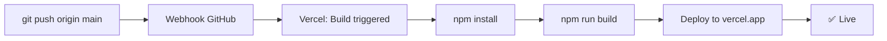

# 🚀 TickFlow - Plan Wdrożenia na Vercel

**Status**: MVP 1.0 Production Deployment Guide  
**Data utworzenia**: 16 października 2025  
**Wersja**: 1.0  
**Cel**: Instrukcja krok po kroku dla wdrożenia na platformie Vercel z automatycznym deploymentem

---

## 📋 Spis treści

1. [Przygotowanie projektu](#przygotowanie-projektu)
2. [Konfiguracja Vercel](#konfiguracja-vercel)
3. [Ustawienie zmiennych środowiskowych](#ustawienie-zmiennych-środowiskowych)
4. [Konfiguracja bazy danych](#konfiguracja-bazy-danych)
5. [Integracja GitHub](#integracja-github)
6. [Deployment](#deployment)
7. [Automatyczne aktualizacje](#automatyczne-aktualizacje)
8. [Monitoring i troubleshooting](#monitoring-i-troubleshooting)

---

## 1. Przygotowanie projektu

### 1.1 Sprawdzenie wersji Node.js

Vercel używa Node.js 20. Upewnij się, że lokalnie pracujesz z wersją Node.js 18+ (zalecane 20).

```bash
node --version  # powinno być v20.x.x
npm --version   # powinno być 10.x.x lub wyżej
```

### 1.2 Aktualizacja package.json (opcjonalne, ale zalecane)

Sprawdź, czy wszystkie krytyc dependencies są aktualne:

```bash
npm update
npm audit fix
```

### 1.3 Weryfikacja lokalnego buildu

Upewnij się, że projekt buduje się prawidłowo:

```bash
npm run lint    # Sprawdzenie lintingu
npm run build   # Budowanie projektu
npm start       # Uruchomienie produkcyjnego buildu
```

**Jeśli build się nie powiódł**, rozwiąż problemy lokalnie zanim przejdziesz dalej.

### 1.4 Commit zmian

Upewnij się, że wszystkie zmiany są committowane:

```bash
git status      # Sprawdź czy jest czyste
git add .
git commit -m "chore: prepare for Vercel deployment"
git push origin main
```

---

## 2. Konfiguracja Vercel

### 2.1 Zalogowanie do Vercel

Otwórz przeglądarkę i przejdź do:

```
https://vercel.com/login
```

Zaloguj się na swoje konto (możesz użyć GitHub, GitLab, Bitbucket lub email).

### 2.2 Utworzenie nowego projektu

1. **Na dashboardzie Vercel** kliknij: `Add New...` → `Project`
2. **Import repository**: Wybierz `Import Git Repository`
3. **Połącz repozytorium**:
   - Wyszukaj `tickflow` (lub nazwę Twojego repozytorium)
   - Kliknij `Import`

### 2.3 Konfiguracja projektu w Vercel

Po importzie zostaniesz przekierowany do konfiguracji projektu.

#### Sekcja: Project Name
- **Name**: `tickflow` (lub inna nazwa)
- **Można zmienić, ale pamiętaj URL**: `https://tickflow.vercel.app` (lub Twoja nazwa)

#### Sekcja: Framework
- Vercel powinien **automatycznie wykryć Next.js**
- Jeśli nie, wybierz ręcznie: `Next.js`

#### Sekcja: Root Directory
- Pozostaw **pusty** (root projektu)

#### Sekcja: Build and Output Settings
- **Build Command**: `npm run build` (domyślnie)
- **Output Directory**: `.next` (domyślnie)
- **Install Command**: `npm install` lub `npm ci` (domyślnie)

**Nie zmieniaj tych ustawień** - są już skonfigurowane prawidłowo.

---

## 3. Ustawienie zmiennych środowiskowych

### 3.1 Przygotowanie zmiennych

Przygotuj wartości dla wszystkich wymaganych zmiennych. Będą potrzebne:

```
DATABASE_URL=postgresql://...
NEXTAUTH_URL=https://tickflow.vercel.app
NEXTAUTH_SECRET=<generated-secret>
NEXT_PUBLIC_SUPABASE_URL=https://xxx.supabase.co
NEXT_PUBLIC_SUPABASE_ANON_KEY=eyJ...
SUPABASE_SERVICE_ROLE_KEY=eyJ...
OPENROUTER_API_KEY=sk-or-v1-...
JWT_SECRET=<generated-secret>
NODE_ENV=production
```

### 3.2 Generowanie sekretów

Jeśli nie masz wygenerowanych sekretów, wygeneruj je teraz:

```bash
# Wygeneruj NEXTAUTH_SECRET
node -e "console.log(require('crypto').randomBytes(32).toString('hex'))"

# Wygeneruj JWT_SECRET
openssl rand -base64 32
```

### 3.3 Dodanie zmiennych do Vercel (Dashboard)

1. **W dashboardzie Vercel** przejdź do: `Project Settings` → `Environment Variables`
2. **Dodaj każdą zmienną**:
   - Kliknij: `Add New`
   - **Name**: `DATABASE_URL`
   - **Value**: Wklej wartość z `.env.local`
   - **Select Environments**: Zaznacz: `Production` (i `Preview` jeśli chcesz)
   - Kliknij: `Save`

3. **Powtórz dla każdej zmiennej**:
   - `NEXTAUTH_URL` → `https://tickflow.vercel.app`
   - `NEXTAUTH_SECRET` → wygenerowany sekret
   - `NEXT_PUBLIC_SUPABASE_URL` → z `.env.local`
   - `NEXT_PUBLIC_SUPABASE_ANON_KEY` → z `.env.local`
   - `SUPABASE_SERVICE_ROLE_KEY` → z `.env.local`
   - `OPENROUTER_API_KEY` → z `.env.local` (opcjonalnie, jeśli chcesz AI suggestions)
   - `JWT_SECRET` → wygenerowany sekret
   - `NODE_ENV` → `production`

**WAŻNE**: Zmienne prefixem `NEXT_PUBLIC_*` będą widoczne w przeglądarce - to normalne i bezpieczne dla tych zmiennych. `SUPABASE_SERVICE_ROLE_KEY` i `JWT_SECRET` **nigdy** nie będą wysyłane do klienta.

### 3.4 Weryfikacja zmiennych

Po dodaniu wszystkich zmiennych, upewnij się, że są widoczne:

```
Environment Variables
├── DATABASE_URL ..................... (Production, Preview)
├── NEXTAUTH_URL ..................... (Production, Preview)
├── NEXTAUTH_SECRET .................. (Production, Preview)
├── NEXT_PUBLIC_SUPABASE_URL ......... (Production, Preview)
├── NEXT_PUBLIC_SUPABASE_ANON_KEY ... (Production, Preview)
├── SUPABASE_SERVICE_ROLE_KEY ........ (Production)
├── OPENROUTER_API_KEY .............. (Production, Preview)
├── JWT_SECRET ....................... (Production)
└── NODE_ENV ......................... (Production)
```

---

## 4. Konfiguracja bazy danych

### 4.1 Sprawdzenie dostępu do Supabase

Upewnij się, że masz dostęp do projektu Supabase:

1. Przejdź na: `https://supabase.com/dashboard`
2. Zaloguj się na to samo konto, które ma `DATABASE_URL`
3. Otwórz Twój projekt
4. Przejdź do `SQL Editor`

### 4.2 Zaznajomienie się z migrациami

Projekt TickFlow posiada gotowe migracje SQL w folderze `supabase/migrations/`:

```
supabase/migrations/
├── 20251009120000_create_enums.sql
├── 20251009120100_create_users_table.sql
├── 20251009120200_create_categories_table.sql
├── 20251009120300_create_subcategories_table.sql
├── 20251009120400_create_tickets_table.sql
├── 20251009120500_create_agent_categories_table.sql
├── 20251009120550_create_tickets_rls_policies.sql
├── 20251009120600_create_agent_role_trigger.sql
├── 20251009120700_create_updated_at_triggers.sql
└── 20251016_add_admin_role.sql
```

### 4.3 Stosowanie migracji

**Ścieżka A: Automatycznie (zalecane)**

Jeśli używasz Vercel + Supabase, możesz skonfigurować automatyczne migracje w ramach CI/CD. Na razie zastosuj je ręcznie.

**Ścieżka B: Ręcznie w Supabase Dashboard**

1. Otwórz `https://supabase.com/dashboard` → Twój projekt
2. Przejdź do: `SQL Editor`
3. Dla każdego pliku migracji:
   - Otwórz plik z `supabase/migrations/`
   - Skopiuj zawartość
   - Wklej w `SQL Editor` Supabase
   - Kliknij: `Run`
   - **Czy nie będzie błędu?** Dobrze. Jeśli będzie, sprawdź czy już istnieje.

**Ścieżka C: Supabase CLI (dla zaawansowanych)**

```bash
# Zainstaluj Supabase CLI
npm install -D supabase

# Zaloguj się
npx supabase login

# Zastosuj migracje
npx supabase db push
```

### 4.4 Sprawdzenie struktur tabel

Po zastosowaniu migracji przejdź do `Table Editor` w Supabase i sprawdź:

- ✅ `users` - tabela użytkowników
- ✅ `categories` - tabela kategorii
- ✅ `subcategories` - tabela podkategorii
- ✅ `tickets` - tabela ticketów
- ✅ `agent_categories` - tabela przypisań agentów do kategorii

### 4.5 Seeding danych (opcjonalnie, na produkcję)

Jeśli chcesz mieć domyślne kategorie i użytkowników testowych na produkcji, użyj skryptów:

```bash
# Tylko dla PRODUKCJI - upewnij się, że DATABASE_URL wskazuje na Vercel!
npm run seed:categories
npm run seed:users
```

**UWAGA**: Wykonaj to **przed** pierwszym deploymentem na Vercel, aby uniknąć błędów.

---

## 5. Integracja GitHub

### 5.1 Sprawdzenie połączenia GitHub

W Vercel projekt powinien być już połączony z GitHub. Sprawdzenie:

1. Przejdź do: `Project Settings` → `Git`
2. Powinien być widoczny: `Repository: <Your-Username>/tickflow`

### 5.2 Konfiguracja gałęzi deploymentu

W sekcji `Git` skonfiguruj:

#### Production Branch (Gałąź produkcji)
- **Branch**: `main` (lub `master`)
- **Effect**: Każdy push na `main` wyzwoli deployment na `https://tickflow.vercel.app`

#### Preview Deployments (Podglądy dla PR)
- **Enable Preview Deployments**: ✅ Zaznaczone
- **Deploy on every push to**: Wszystkie gałęzie **poza `main`**

Dzięki temu:
- Push na `main` = deployment na **produkcję**
- Push na inną gałąź = **preview deployment** (np. `https://tickflow-my-branch.vercel.app`)
- PR = automatyczny preview z komentarzem w PR

### 5.3 Ignorowanie buildów (opcjonalnie)

Jeśli chcesz pominąć deployment dla określonych plików:

1. Przejdź do: `Project Settings` → `Git`
2. **Ignore Build Step**: Dodaj (opcjonalnie)
   ```
   docs/**
   *.md
   README.md
   ```

Dzięki temu zmiany w dokumentacji **nie** będą wyzwalać deploymentu.

---

## 6. Deployment

### 6.1 Pierwszy deployment

**Metoda 1: Z dashboardu Vercel (najprostsze)**

1. Przejdź do: `https://vercel.com/dashboard`
2. Otwórz projekt `tickflow`
3. Kliknij: `Deployments`
4. Kliknij: `Deploy` (na głównym ekranie)

**Metoda 2: Git push**

Jeśli wszystko skonfigurowane, wystarczy:

```bash
git push origin main
```

Vercel automatycznie:
1. Pobierze kod z GitHub
2. Zainstaluje dependencies (`npm install`)
3. Uruchomi linting (`npm run lint`)
4. Zabuduje projekt (`npm run build`)
5. Wdroży na `https://tickflow.vercel.app`

### 6.2 Monitorowanie deploymentu

Podczas deploymentu w dashboardzie Vercel będziesz widzieć:

```
Deployment Status
├── ✅ Building... (15-30 sekund)
├── ✅ Running Tests... (jeśli skonfigurowane)
├── ✅ Running Build Step... (npm run build)
├── ✅ Creating Deployment Artifacts...
├── ✅ Finalizing Deployment...
└── ✅ Ready! (Deployments are currently live!)
```

### 6.3 Odwiedzenie wdrożonej aplikacji

Po zaraz po pojawieniu się ✅, aplikacja jest dostępna:

```
https://tickflow.vercel.app
```

**Testowanie**:
1. Otwórz aplikację
2. Spróbuj zalogować się z testowymi danymi (jeśli zasetdeowałeś bazy danych)
3. Sprawdź czy połączenie z Supabase działa
4. Przetestuj tworzenie ticketu
5. Sprawdź real-time updates

---

## 7. Automatyczne aktualizacje

### 7.1 Automatic Deployments (Automatyczne deployments)

Vercel domyślnie wdraża automatycznie po każdym push na gałąź produkcji:



**Nic nie musisz robić** - Vercel obserwuje gałąź `main` i automatycznie deployuje.

### 7.2 Testowanie automatycznego deploymentu

Zrób test:

```bash
# Edytuj coś w pliku
echo "# Test" >> README.md

# Committuj i push
git add .
git commit -m "test: automatic deployment"
git push origin main
```

Obserwuj dashboard Vercel - powinien się pojawić nowy deployment.

### 7.3 Konfiguracja CI/CD (GitHub Actions)

Projekt ma gotowy CI/CD w `.github/workflows/`:

```
.github/workflows/
├── github-actions.yml  (na każdy push na main)
└── pull-request.yml    (na każdy PR)
```

**Funkcjonalność**:

- **On `main` push**:
  - Uruchomi testy (`npm run test:coverage`)
  - Uruchomi E2E testy (`npm run test:e2e`)
  - Zaraportuje coverage
  - Wdroży na Vercel

- **On PR**:
  - Uruchomi linting
  - Uruchomi testy
  - Zaraportuje wyniki w komentarzu PR

**Status**: CI/CD jest już skonfigurowany, nic nie musisz dodawać.

### 7.4 Notyfikacje

Aby otrzymywać powiadomienia o deploymentach:

1. W Vercel: `Project Settings` → `Notifications`
2. Zaznacz:
   - ✅ `Deployment Started`
   - ✅ `Deployment Completed`
   - ✅ `Deployment Error`
3. Wybierz: `Email` lub `Slack` (jeśli masz)

---

## 8. Monitoring i troubleshooting

### 8.1 Logi deploymentu

**Podczas deploymentu:**

1. Otwórz dashboard Vercel
2. Otwórz projekt `tickflow`
3. Przejdź do `Deployments`
4. Kliknij na ostatni deployment
5. Kliknij `Build Logs` lub `Runtime Logs`

**W logach szukaj**:
- ✅ `Cloned environment` - kod pobrany
- ✅ `Running "npm install"` - dependencies zainstalowane
- ✅ `Running "npm run build"` - build uruchomiony
- ✅ `Deployment ready` - wdrożenie gotowe
- ❌ Błędy (jeśli jakieś są)

### 8.2 Częste problemy i rozwiązania

#### Problem 1: Build fails - Missing environment variables

**Objawy**: Błąd `error: process.env.NEXT_PUBLIC_SUPABASE_URL is undefined`

**Rozwiązanie**:
1. Przejdź do: `Project Settings` → `Environment Variables`
2. Sprawdź czy wszystkie zmienne są ustawione
3. Upewnij się, że zaznaczono `Production`
4. Kliknij `Redeploy` w dashboardzie

#### Problem 2: Build fails - Database connection error

**Objawy**: Błąd `error: could not connect to database`

**Rozwiązanie**:
1. Sprawdzenie `DATABASE_URL` - czy wskazuje na Supabase produkcji?
2. W Supabase dashboard - czy baza danych jest dostępna?
3. Sprawdź czy IP Vercel jest whitelisted w Supabase (domyślnie powinno być)

#### Problem 3: Application runs but shows error on page

**Objawy**: Białą stronę lub błąd w przeglądarce

**Rozwiązanie**:
1. Otwórz `Browser Console` (F12)
2. Szukaj błędów
3. Przejdź do `Project Settings` → `Function Logs` w Vercel
4. Szukaj błędów w logach

#### Problem 4: Real-time updates not working

**Objawy**: Tickety nie aktualizują się w czasie rzeczywistym

**Rozwiązanie**:
1. Sprawdź czy `NEXT_PUBLIC_SUPABASE_URL` i `NEXT_PUBLIC_SUPABASE_ANON_KEY` są prawidłowe
2. W Supabase, przejdź do: `Project Settings` → `Realtime` → Sprawdź czy jest włączone
3. Sprawdź czy tabele mają RLS enabled (Resource Level Security)
4. Przejrzyj `Runtime Logs` w Vercel

### 8.3 Monitoring production

**Ważne**: Po wdrożeniu na produkcję monitoruj:

1. **Vercel Analytics**: `Project` → `Analytics`
   - Response time
   - Deployment duration
   - Build size

2. **Supabase Logs**: `https://supabase.com/dashboard` → `Logs`
   - Zapytania do bazy danych
   - Błędy RLS
   - Realtime connections

3. **Browser Console** (u użytkowników):
   - Sprawdzaj czy ktoś raportuje błędy
   - Monitoruj Network tab

### 8.4 Rollback (Cofnięcie deploymentu)

Jeśli coś poszło nie tak na produkcji:

1. Przejdź do: `Deployments` w Vercel
2. Znajdź poprzedni, działający deployment
3. Kliknij `...` → `Redeploy`

Aplikacja wróci do poprzedniej wersji w kilka sekund.

---

## 9. Konfiguracja Advanced (Opcjonalnie)

### 9.1 Custom Domain

Jeśli masz własną domenę (np. `tickflow.twojafirma.pl`):

1. Przejdź do: `Project Settings` → `Domains`
2. Kliknij: `Add`
3. Wpisz: `tickflow.twojafirma.pl`
4. Postępuj zgodnie z instrukcjami (zwykle wymaga zmian w DNS)

### 9.2 SSL Certificate

Vercel **automatycznie** generiuje SSL certifikaty (Let's Encrypt). Nic nie musisz robić.

### 9.3 Performance Optimization

Vercel automatycznie optymalizuje:
- ✅ Compression (gzip, brotli)
- ✅ Image optimization (Next.js Image component)
- ✅ Code splitting
- ✅ Caching headers

**Nic nie musisz konfigurować** - działa out-of-the-box.

### 9.4 Skalowanie (Auto-scaling)

Vercel automatycznie skaluje zasoby na podstawie traffic. Możesz:

1. Przejdź do: `Project Settings` → `Scaling`
2. Ustaw limity zasobów (opcjonalnie)

**Dla MVP**: Ustawienia domyślne są wystarczające.

---

## 10. Checklist wdrażania

Zanim zatwierdzisz deployment na produkcję, sprawdź:

- [ ] Kod committowany i spushowany na `main`
- [ ] Vercel projekt utworzony i połączony z GitHub
- [ ] Wszystkie zmienne środowiskowe ustawione w Vercel
- [ ] `NEXTAUTH_URL` wskazuje na `https://tickflow.vercel.app`
- [ ] `DATABASE_URL` wskazuje na produkcyjną bazę Supabase
- [ ] Migracje SQL zastosowane w Supabase
- [ ] Dane testowe zasetdeowane (jeśli potrzebne)
- [ ] Lokalnie: `npm run build` przechodzi bez błędów
- [ ] Lokalnie: `npm run start` działa prawidłowo
- [ ] Pierwszy deployment uruchomiony (z dashboard lub git push)
- [ ] Aplikacja dostępna i działająca na `https://tickflow.vercel.app`
- [ ] Zalogowanie działa
- [ ] Tworzenie ticketu działa
- [ ] Real-time updates działają
- [ ] GitHub Actions CI/CD działają prawidłowo

---

## 11. Aktualizacje i maintenance

### 11.1 Regularne aktualizacje

```bash
# Sprawdzenie dostępnych aktualizacji
npm outdated

# Aktualizacja dependencies (safe)
npm update

# Aktualizacja do nowych major versions (ostrożnie!)
npm install next@latest

# Zawsze testuj lokalnie!
npm run build
npm run test:all
```

### 11.2 Monitorowanie problemów

Co tydzień:
- [ ] Przejrzyj `Deployments` - czy ostatni deployment się powiódł?
- [ ] Sprawdź `Logs` w Vercel - czy są błędy?
- [ ] Sprawdź `Database Logs` w Supabase
- [ ] Sprawdź `Analytics` - czy performance jest OK?

### 11.3 Backup bazy danych

Supabase automatycznie wykonuje backupy. Ale zalecamy:

1. Co tydzień: Ręczny export bazy danych z Supabase
2. W Supabase: `Database` → `Backups` → `Download`
3. Przechowuj lokalnie lub w S3

---

## 12. Podsumowanie

### Deploy w 5 minut (TL;DR)

```bash
# 1. Dodaj zmienne do Vercel (dashboard)
# NEXTAUTH_URL=https://tickflow.vercel.app
# itp. (patrz punkt 3)

# 2. Zastosuj migracje w Supabase (ręcznie lub CLI)

# 3. Zacommittuj i push
git add .
git commit -m "deploy: production ready"
git push origin main

# 4. Obserwuj dashboard Vercel - powinien się pojawić deployment

# 5. Po ~30 sekundach aplikacja powinna być dostępna:
# https://tickflow.vercel.app
```

### Automatyczne aktualizacje (po setup)

```bash
# Od teraz wystarczy:
git push origin main

# I aplikacja sama się zaktualizuje na Vercel! 🚀
```

---

## 📚 Zasoby

- [Vercel Documentation](https://vercel.com/docs)
- [Next.js Deployment](https://nextjs.org/docs/deployment)
- [Supabase CLI](https://supabase.com/docs/guides/cli)
- [Environment Variables Best Practices](https://vercel.com/docs/concepts/projects/environment-variables)
- [TickFlow PRD](./.ai/prd.md)
- [TickFlow Tech Stack](./.ai/tech-stack.md)

---

**Powodzenia! 🚀 Jeśli będą problemy, sprawdź logi deployment w Vercel lub skontaktuj się ze wsparciem Vercel.**
